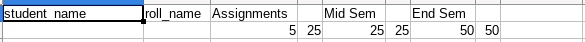

# Raw Input

There are two types of files:
- `courses.csv`: contains information related to all courses offered. Has three headers
- `<%= course_code %>.csv`: contains mark obtained by all registered students in one course.

The first line contains name, roll number, exam names whereas the numbers in the column before an exam represent maximum numbers in the exam and the weightage.

In the above example, `Assignments` can have a maximum score of five and has a weightage of twenty-five. Hence, each mark of assignment scales fives time to the final count.

### Gotchas

Here are some gotchas you need to be careful of:
- Names can be repeated but roll numbers are unique
- Marks can be floating point numbers, but only upto two decimal points.
- If marks obtained by a student in an exam is greater than maximum marks, correct the marks obtained to maximum
- If marks obtained by a student in an exam is missing or are negative, assume they have obtained zero marks.
- A student does not have to register for all courses.
